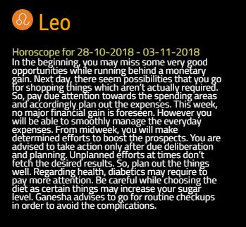
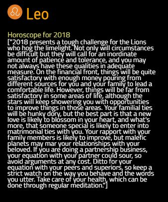

# MMM-Astrology
Horoscopes for daily, weekly, monthly or yearly!  For the MagicMirror2

Instructions:

Terminal Window instructions:  

  Go to:  
        ~MagicMirror/modules  
         git clone "https://github.com/rafhtl/MMM-Astrology.git"  
## Example

Daily
 

Week


Month
 

Year
 
 
## Configuration options

The following properties can be configured:

| Option | Description
| --- | ---
| `starSign` | The star sign to display. Must be lower case. <br><br> **Example values:** `leo`, `aries`, `pisces`<br>**Default value:** none
| `hScope` | The type of horoscope to display. <br><br> **Possible values:** `daily`, `week`, `month`, `year`<br>**Default value:** none<br>CAUTION:  Yearly horoscopes are VERY large in most cases will take up entire screen! 
|`tcolor`| color of your horoscope

## Example configuration
[MUST follow the instructions.  I have NO checks in there yet to convert text so it's up to you to enter it correctly!]
```
added possibility to show different horoscopes with a notification of next and previous
needs an array on config

{
            module: 'MMM-Astrology',
            disabled: false,
            position: 'middle_center',
            config: {
                starSigns: ["scorpio","aquarius"],
                hScope: "daily",
                tcolor: "white"
            }
        },

Start mirror...enjoy! 

additions rdr

need to install 
sudo apt-get install translate-shell

trans -R the languages
trans :it 'hello how are you?' from english to italian

added to config
translation_languages: ["it"], //will translate to language if left blank will just report to en
starSigns: ["scorpio","aquarius"], //with a 
